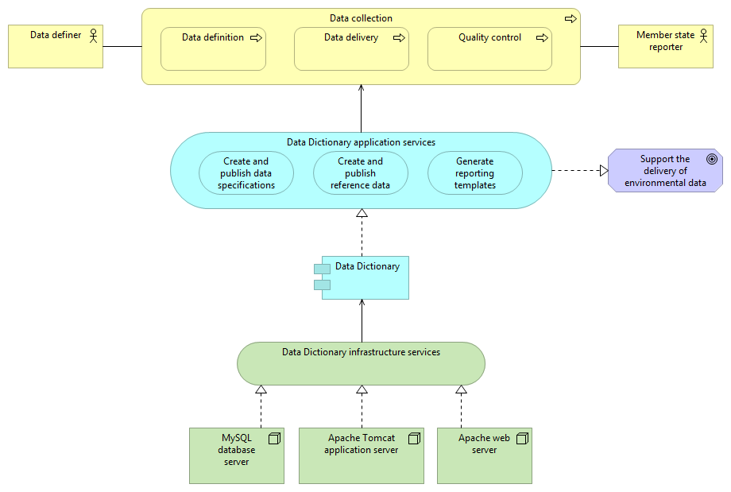
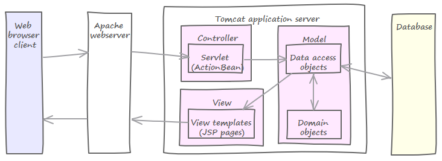

# Data Dictionary (DD)

## Introduction

Data Dictionary (DD) is a web-based data semantics registry for the Reportnet. It holds definitions of datasets, tables and data elements exchanged over the Reportnet, whether by humans or applications. These are called data definitions and DD provides functions to import such definitions in a machine-readable form, manage them through a web-based user interface and export them both in machine and human readable formats. An API for other applications to perform selected operations is also included.

## Getting started for users

To get started browsing existing dataset definitions, reference data, schemas and eventually create new- or edit existings ones, see the [User guide](https://github.com/eea/eionet.datadict/blob/master/doc/DD-User-Guide.odt?raw=true) for instructions.

## Getting started for developers

To get started setting up the application, follow the steps outlined below on how to install the application. After having tried it, see the [Application architecture guide](https://github.com/eea/eionet.datadict/blob/master/doc/Data%20Dictionary%20-%20Application%20Architecture.docx?raw=true) for a deeper understanding of the architecture and functionality of DD.

To use the API exposed by DD, see the API reference below for an introduction, and [Application architecture guide](https://github.com/eea/eionet.datadict/blob/master/doc/Data%20Dictionary%20-%20Application%20Architecture.docx?raw=true) for detailed request and response formats etc.

## Features and architecture overview

### Main features

The DD implementation covers a database model supporting about ~70% of the data semantics functionality suggested by [ISO11179](http://metadata-standards.org/11179):

*  Part 1 (Framework for the specification of data elements)
*  Part 2 (Classification for Data Elements)
*  Part 3 (Basic Attributes of Data Elements)
*  Part 5 (Naming and Identification Principles for Data Elements)

Part 4 about "Rules and Guidelines for the Formulation of Data Definitions" and part 6 about "Registration of Data Elements" are not directly followed, as found cumbersome for DD needs. Note the above list has not been implemented to the fullest. On top of the ISO functionality-compliant data model, a user interface is implemented for 

*  managing definitions of datasets,
*  managing definitions of tables,
*  managing definitions of data elements,
*  managing definitions of metadata (i.e. attributes in DD terminology)

Support for representing any of these definitions in XML Schema format has been implemented. However, only a fraction of XML Schema specification is supported. The application supports:

*  Declaration of elements
*  Element annotations
*  Value domain annotations
*  Simple types
*  Restrictions based on simple types
*  Complex types

To enable comfortable data definition process, a trivial Import tool based on MS Access is implemented for managing definitions in a flat table format. The tool generates XML of what has been entered into its tables and the XML is then finally imported into DD database.

### Architecture overview

This diagram illustrates the Data Dictionary application and its context.

[](DD-Overview.png "DD overview diagram - click to enlarge")

Starting from the bottom, the application is running with the help of an infrastructure service, consisting of a web server, an application server and a database server. The application itself provides three main services to the business, which is the data collection process. This process has two main stakeholders. The goals and drivers of this process are not depicted in this diagram, but the application itself has a goal that is realised by its services.

From a more technical point of view, the system architecture of the Data Dictionary consists of three main layers. The presentation layer, providing both access through a human user- and a machine service interface. These interfaces are realised in components residing in the business layer, which in turn use the data layer for access to the underlying database- and external services providing data to the application. Throughout the application layers, security and logging components are used.

[](architecture_overview.png "Application architecture overview - click to enlarge")

The DD application presentation layer is implemented with the help of the Stripes framework, using the Model – View – Controller (MVC) pattern, to separate the concerns of presentation logic, business logic and data access. When a HTTP request comes in, it is handled by a controller (Action Bean) that return a view template (JSP page) populated with data. Although it is not strictly enforced throughout the whole application, as in some cases the view template directly interacts with the data access layer.

The business layer, where the parts directly concerning the business domain represents the model in MVC, is implemented as regular Java classes.

DD provides a service interface in the form of an XML-based web service endpoint.

## Installation, deployment and configuration

###  Install the application

#### Using Docker

Text here...

#### Manual installation

For further details see the [Installation manual](https://github.com/eea/eionet.datadict/blob/master/doc/DD%20Installation%20Manual.odt?raw=true).

##### Prerequisites

DD has been tested and run on Tomcat Java Servlet Container and MySQL. Please download all of these software and install them according to the instructions found at their websites: [Tomcat](https://tomcat.apache.org), [MySQL Server](https://www.mysql.com)

The necessary versions are as follows:

* Java 1.6 or higher
* Tomcat 6 or higher
* MySql 5.1.71 or higher

##### Build the source code

Create a build of the DD source code, see [Build the application from source code](#build-the-application-from-source-code).

##### Set up the DD database
Create the DD database and database user in MySql matching the db configuration values in _local.properties_ from the build step.

```sh
$ mysql -u root -p
```

```sql
create database DataDict;
CREATE USER 'dduser'@'localhost' IDENTIFIED BY 'password-here';
GRANT ALL PRIVILEGES ON DataDict.* TO 'dduser'@'localhost';
```

##### Import initial seed data

Create  initial database structure
```sh
$ cd $CHECKOUT_HOME
$ mvn liquibase:update
```
Import seed data required for DD to operate
```sh
$ mvn -Dliquibase.changeLogFile=sql/dd-seeddata.xml liquibase:update
```

##### Register Eionet's GlobalSign CA certificates in your JVM _(optional)_

This step is required for making the EEA's Central Authentication Service (CAS) work with your DD. You need to register Eionet certificates in the JVM that runs the Tomcat where you deploy the DD. A small Java executable that does it, and a README on how to use it can be found here: https://svn.eionet.europa.eu/repositories/Reportnet/CASServer/contrib/installcert

##### Deploy the build

Place the resulting `$CHECKOUT_HOME/target/datadict.war` into Tomcat's webapps directory, and start Tomcat.

For more detailed instructions see the [Installation manual](https://github.com/eea/eionet.datadict/blob/master/doc/DD%20Installation%20Manual.odt?raw=true).

### Build the application from source code

DD runs on the Java platform and The source code is built with Maven. Please download all of these software and install them according to the instructions found at their websites: [Java JDK](http://www.java.com/), [Apache Maven](https://maven.apache.org), and [Git](https://git-scm.com/) (to clone the repository, optional).

The necessary versions are as follows:

* Java 1.6 or higher
* Maven 3.0.2 or higher
* GIT 1.8.4 or higher

#### Download source code

Create build directory for source code and get code from GitHub

```sh
$ cd /var/local/build
$ git clone https://github.com/eea/eionet.datadict.git
```
Note: the resulting `/var/local/build/eionet.datadict` directory will be denoted below as `$CHECKOUT_HOME`

#### Adjust environment properties

Create _local.properties_ file by making a copy of _default.properties_.

```sh
$ cd $CHECKOUT_HOME
$ cp default.properties local.properties
```

In the freshly created _local.properties_ file, change property values as  appropriate for your environment. You will find meanings of every property  from inside the file as comments.

#### Run the build process

The application install package is built with maven

```sh
$ cd $CHECKOUT_HOME
$ mvn -Dmaven.test.skip=true clean install
```

### Test the application

####  Run the unit tests

The unit test mechanism will install its own embedded  database and create the tables when you execute them. Note that the MySQL database will keep running afterwards. You can run individual tests with: -Dtest=DatasetImportHandlerTest

```sh
$ cd $CHECKOUT_HOME
$ mvn -Denv=unittest -Dmaven.test.skip=false test
```

### Configuration

#### Custom headers and footers configuration _(optional)_
Revise $CHECKOUT_HOME/custom/*.txt files for modifying the content of headers and footers in DD web pages texts and links.  You will find guidelines from inside $CHECKOUT_HOME/custom/README.txt.

#### Additional applications for modifying DD access permissions and help texts

Additional web applications are available for modifying user privileges and help texts in DD:
AclAdmin tool: https://svn.eionet.europa.eu/repositories/Reportnet/acladmin/trunk
HelpAdmin tool: https://svn.eionet.europa.eu/repositories/Reportnet/helpadmin/trunk

Installing these applications is done by similar steps:

1. Checkout from SVN
2. Create local.properties from default.properties
3. Modify environment specific properties in local.properties file
4. call "mvn install"
5. Rename acladmin.properties.dist/helpadmin.properties.dist to acladmin.properties/helpadmin.properties in ROOT/WEB-INF/classes folder and revise the content of the properties files
6. Rename *.acl.dist files to *.acl files in acladmin_contents/acls folder (only in AclAdminTool) and revise the contents of acladmin.group file
  More detailed information about ACL's is available at: http://taskman.eionet.europa.eu/projects/reportnet/wiki/AccessControlLists
7. Copy the created war files to tomcat webapps folder and start tomcat
Please find more detailed information in documentation of these applications

## Maintenance

### Monitoring

Text here...

### Create backups

Text here...

### Common problems 

Text here...

## API reference

DD provides a service interface in the form of an XML-based web service endpoint. 

To call the service interface, an http post request should be sent to the URL `http://<data dictionary URL>/rpcrouter`, and in the body of the request both the method to call, and the necessary parameters should be specified as in this example:

```xml
<methodCall>
  <methodName>DataDictService.getDatasetWithReleaseInfo</methodName>
  <params>
    <param><value><string>tbl</string></value></param>
    <param><value><string>8374</string></value></param>
  </params>
</methodCall>
```

Example in Java (include uit-client.jar and xmlrpc.jar into the class path):

```java
import eionet.rpcclient.ServiceClients;
import eionet.rpcclient.ServiceClientIF;
import eionet.rpcclient.ServiceClientException;
import java.util.Vector;
public class TestClass {
    public static void main (String args[]) {
        try {
            String srvName = "DataDictService";
            String methName = "getObligationsWithDatasets";
            String srvUrl="http://dd.eionet.europa.eu/rpcrouter";
            Vector params = new Vector();
            ServiceClientIF srv = ServicesClients.getServiceClient(srvName, srvUrl, ServiceClientIF.CLIENT_TYPE_XMLRPC);
            Object value = srv.getValue(methName, params);
            System.out.println(methName + "value=" + value);
        }
        catch (Exception e) {
            System.out.println(“Error “ + e.toString());
        }
    }
}
```

### Operations

For details about the API operations listed below, see the [Application architecture guide](https://github.com/eea/eionet.datadict/blob/master/doc/Data%20Dictionary%20-%20Application%20Architecture.docx?raw=true) and the DD XML-RPC service descriptor file (src/main/webapp/DataDictService.xml).

#### getDatasetWithReleaseInfo
This method returns dataset release info for the given object id and object type in the form of a hash table with the dataset release info.

#### getDSTables
This method returns all tables of all released datasets, including historic versions. 

#### getObligationsWithDatasets
Returns a list of structures where every structure represents one obligation whose metadata is given by two keys.

#### getParametersByActivityID
Data elements in DD have a static attribute indicating if the element is to be considered a ROD parameter. For identifying parameters by a given reporting activity, the DD first associates the given activity ID with a concrete dataset and then returns all elements that are defined as ROD parameters and defined within the concrete dataset. And this is what this very method does. As an input, it takes a STRING containing the ID of the reporting activity. As an output, it returns an ARRAY of STRUCTs where each STRUCT represents one ROD parameter matching to the given reporting activity. 

## Copyright and license

Data Dictionary is licensed under Mozilla Public License Version 1.1, please see [License.txt](https://github.com/eea/eionet.datadict/raw/master/LICENSE.txt) for more information.

