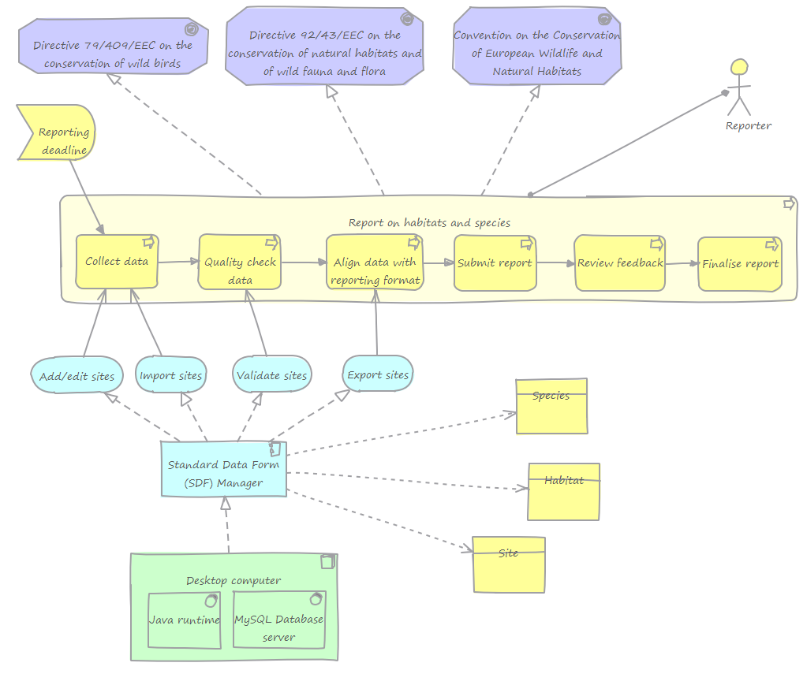

# Standard Data Form (SDF) Manager

## Introduction

The Natura 2000 and Emerald Standard Data Form (SDF) Manager application can in short be explained by the following table.

<table>
  <tr>
      <td colspan="4"><strong>Vision:</strong> Create a tool to help reporters easily deliver high quality data</td>
   </tr>
   <tr>
      <td><strong>Target group:</strong> <br />Reporters from member states and emerald countries.</td>
      <td><strong>Needs:</strong> <br />It is difficult to manually produce the XML-file for reporting and to validate its contents.</td>
      <td><strong>Product:</strong> <br />Local application that imports file- or database data. <br />Provides simple validation of data. <br />Exports data into reporting format.</td>
      <td><strong>Value:</strong> <br />Higher quality deliveries from member states and emerald countries. <br />Goodwill for the EEA.</td>
   </tr>
</table>

## Getting started for users

First follow the installation instructions below, then see the [User guide (pdf)](SDF Manager - User guide.pdf) for getting started with managing your site information.

## Getting started for developers

First follow the build and installation instructions below to get the application up and running from your own build of the source code.

Review the application architecture below to get more familiar with the what goals, processes and users the application it there to support. Then browse the [User guide (pdf)](SDF Manager - User guide.pdf) to better understand how these process steps are implemented in the application for the users.

## Features and architecture overview

### Main features

The main features of the application are:

* Creating new- or edit existing sites
* Searching and filtering sites
* Deleting one or multiple sites
* Checking sites for quality issues
* Importing sites from MS Access or XML-files
* Exporting sites as MS Access or XML-files
* Exporting sites as PDF-documents

### Architecture overview

This diagram illustrates the SDF Manager application and its context.

[](architecture_overview.png "Architecture overview diagram - click to enlarge")

Starting from the bottom, the application is a desktop tool running on Java, supported also by a MySQL database server.

The application is in a logical sense made up of a single component (the desktop application) that offers four main services to the user (add/edit sites, import sites, validate sites and export sites). These application services supports some of the steps in the business process of reporting on habitats and species, which in turn is driven by three different legislation's.

The process is normally started by the approaching reporting deadline, and the main actor in this process is the member state- or Emerald reporter.

The main types of information handled by the application are species, habitats and sites.

## Installation, deployment and configuration

### Install the application

#### Prerequisites

The application requires the following software to be installed:

* Microsoft .Net Framework 4.0 needs to be installed in order to run the MySQL Server installation. See http://www.microsoft.com/download/en/details.aspx?id=17851 for instructions on how to install it.
* MysSQL Server. The SDF Manager uses the MySQL database server for storing the application data. See the [MySQL Server installation instructions](xxx) for more information on how to install it.
* Microsoft Access 2003, 2007, 2010 or later. To import/export sites from and to an Microsoft Access database you will need to have MS Access installed on your computer.

#### Installation steps 

1. Download the `SDFManagerSetup_vX.x.x.exe` (where the 'x':s symbolizes the version number) from the [GitHub releases page](https://github.com/eea/eionet.nat2000.sdfmanager/releases/latest), double-click the file to start the installation and follow the instructions. 

3. Once installed, run `SDFManager-X.x.x.exe`.

4. The first time the application is run it will ask whether you will be working with Emerald- or Natura2000 data, and for the connection details to the MySQL database server installed as part of the dependencies.

For other operating systems than Microsoft Windows, download `SDFmanager-X.x.x.zip` instead of the .exe-release and extract the files to a folder. Since this package does not include a Java Runtime (JRE), you need to manually install JRE first, see [www.java.com](http://www.java.com/). After having installed JRE, run `java -jar SDFmanager-X.x.x.jar`, or double-click on the .jar-file. 

### Build the application from source code

This step is only needed if you plan to modify the source code of the application and create an installable version from that. Note that you will need to have [Java JDK](http://www.java.com/), [Apache Maven](https://maven.apache.org), and preferably also [Git](https://git-scm.com/) installed.

#### Download source code

Create a directory for the source code and download it from GitHub

```sh
git clone https://github.com/eea/eionet.nat2000.sdfmanager.git
```

#### Build the application for development

To produce an executable .jar-file, run

```sh
mvn -Dmaven.test.skip=true clean package
```

#### Build the application for production

To build a distributable installation package for Microsoft Windows computers:

1. Download and install Inno Setup from [http://www.jrsoftware.org](http://www.jrsoftware.org/isdl.php#stable) _(Note: be sure to install also the Inno Setup Preprocessor that the installer suggests)_.

2. Add the Inno Setup path where iscc.exe resides to Windows system environment PATH variable.

3. Copy a JRE (Java Runtime Environment) to [project folder]/jre _(note: the JRE used must be 32-bit)_.

5. Run `mvn -Dmaven.test.skip=true clean install` and the executable installer file named SDFManagerSetup_v[ver no].exe will be created in the project root directory.

### Test the application

#### Run the unit tests

Use Maven to execute the unit tests

```sh
mvn test
```

### Configuration

The application configuration is kept in the file `sdf.properties`, located in the application folder.

To change between Natura 2000 and Emerald mode after the initial setup phase, edit this file and set `application.mode` to "Natura2000" or "EMERALD" for the respective modes of the application. 

For updating the MySQL database connection settings, update the values for `db.host`, `db.password`, `db.user` and `db.port` where necessary.

If this file is deleted the application will present a dialogue as during the installation for entering these settings.

## Maintenance

### Monitoring

Log files generated by the application can be found in the folder ‘Logs’ in the directory where the application was installed. The main log file is `sdfLog-<date>.log`. Additional log files will be generated for imports and exports.

### Create backups

Using the regular application functionality for exporting sites into a Microsoft Access database- or an XML-file can be useful for making backups of your site information. For performing regular database backups of the respective "natura2000" and "emerald" databases, please refer to the [general documentation for MySQL](http://dev.mysql.com/doc).

### Common problems 

Copy-pasting does not work using the regular righ-click click menu from MS Windows 

* Use the keyboard shortcuts Ctrl-C + Ctrl-V (Cmd-C, Cmd-V on Macintosh) instead.

## Copyright and license


