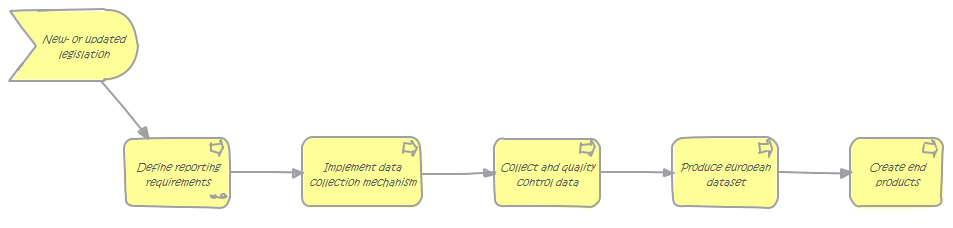

# Understanding the data reporting process

## Overview

Reportnet tools aim to improve the harmonisation and standardisation of the management of all Eionet data flows, by covering all activities inside them, from the detailed definition of the requested data to the generation of the final information products such as reports or environmental indicators.

## Define reporting requirements

The [Data Dictionary](http://dd.eionet.europa.eu/) is maintained by the EEA for certain data flows. It contains detailed specifications concerning the format of the data to be submitted. It also provides definitions of data elements and data types and makes data reporting templates, schemas and guidelines available. If the DD is to be used, ROD redirects the user to DD.

