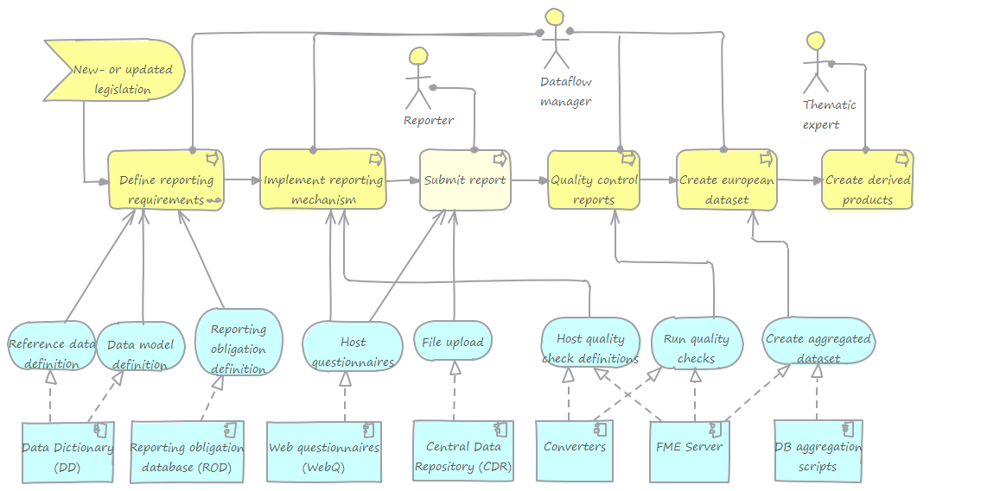

# The Reportnet platform

## Introduction

In order to assist member countries in their data reporting task, the European Environment Agency (EEA) has been developing an infrastructure for supporting and improving the environmental data and information flows. This reporting infrastructure and the related suite of web-based tools and applications are referred to as *Reportnet*. 

## Getting started for users

## Getting started for developers

To get started understanding and implementing things on top of the Reportnet platform, see these guides:

* [Understanding the data reporting process](Understanding-the-data-reporting-process)
* [Implementing a simple dataflow](Implementing-a-simple-dataflow)

## Features and architecture overview

### Main features

Reportnet has a number of features to manage the dataflow process:

* Create and manage reference data
* Create and manage data models
* Host and execute questionnaires
* Upload files and manage folders
* Host and execute quality checks
* Send notifications on events in the dataflow process

### Architecture overview

The start for IT-related work in the dataflow process is normally triggered by new- or updated legislation. This process is mainly run by the dataflow manager, and is supported by a set of logical services that are implemented in the different IT-systems involved.

## API Reference
